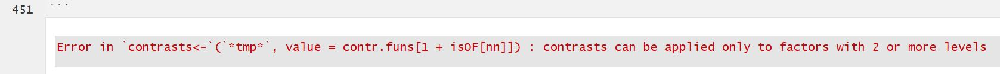

```{r setup, include=FALSE}
knitr::opts_chunk$set(echo = TRUE, rows.print=25)
set.seed(42)

library(foreign)
library(readstata13)
library(dplyr)
library(naniar)
library(glmnet)
require(ggplot2)
require(MASS)
require(Hmisc)
require(reshape2)
library(cluster)
library(VIM)
library(readxl)

```


## Loading the data

Load prepared dataframes which have the correct levels encoded as both text (each GERMAN -> df_geda_de + ENGLISH -> df_geda_en) as well as in integers -> df_geda_num. This is done as value-labels is not preperly implemented in R while maintaining dplyr functions for aggregations and data preprocessing.

```{r}

load(file = "data/geda_data.RData")

df_meta_lvls <- read_excel("data.doc/GEDA14_Variablenuebersicht_Analyse.xlsx", sheet='levels')

df_meta_lvls$numLevel <- as.numeric(df_meta_lvls$numLevel)

df_meta_vars <- df_meta_lvls %>% dplyr::select(Varname, VarLabel, VarLabelEn, ThemeEn) %>% group_by_all(.) %>% dplyr::summarize()


```


```{r, echo=FALSE}
df_tmp <- df_meta_lvls[df_meta_lvls$Varname == 'SHseh2C',]
```

In order to implement variable reduction, LASSO shall be used. As most variables are categorical ones, a conversion into numeric format is done for simplicity reasons. However, one has to note that most variables are binary or ordinal ones anyway which strengthens this argument further.
This shall be illustrated with the variable 'SHseh2C' (`r df_tmp[1,]$VarLabelEn`) that is asking for difficulties to see properly, even when wearing glasses:

```{r}
df_tmp %>% dplyr::select(Varname, textLabelEn, numLevel)
```


Based on a first functional selection, few variables can be excluded from the original dataset as they depict the same information in different categories (e.g. multiple fields depict the age group in different bin sizes). Hence, the following dataset is the baseline of the analysis.

For this analysis, the conversion into numeric levels is required to execute variable reduction techniques.

```{r}

df_geda_non_filtered_q <- df_geda_num %>% dplyr::select(c(
KHhyp12, # Hypertension: I.d.l.12 Mon.
KHhyp, # Hypertension: Ever diagnosed medically
KHhyp12pB, # Indicator bek. (Ärztl. Diagn.) Hypertension pressure i.d.l. 12 Mon
KHhypmedC, # Indicator antihypertensive agents with known hypertension
KHmyo12, # Heart Attack: I.d.l. 12 Mon.
KHkhk12, # Coronary heart disease / angina pectoris: I.d.l.12 Mon.
KHbbmyo12, # Heart attack / chron. Plaints .: I.d.l. 12 Mon.
KHhi12, # Heart failure: I.d.l.12 Mon.
KHsa12, # Stroke: I.d.l.12 Mon.
KHbbsa12, # Stroke / chron. Complaints resulting SA: I.d.l.12 Mon.
KHdiabB12, # Diabetes: I.d.l.12 Mon.
KHab12, # Asthma: I.d.l.12 Mon.
KHkarz12, # Cancer: I.d.l.12 Mon.
KHlip12A, # Elevated blood lipids / Chol .: I.d.l.12 Mon.
KHlipA, # Ever elevated blood lipids / Cholesterinw. (Physician diagnosis)
KHlipmedA, # Elevated cholesterol: Currently taking medication
KHcb12, # Chronic bronchitis: I.d.l.12 Mon.
KHulc12, # Gastric or duodenal ulcer: I.d.l.12 Mon.
KHced12, # Inflammatory bowel disease: I.d.l.12 Mon.
KHlz12, # Cirrhosis: I.d.l.12 Mon.
KHcle12, # Other chronic liver diseases: I.d.l.12 Mon.
KHniB12, # . Chronic kidney problems: I.d.l.12 Mon.
KHdge12, # Osteoarthritis: I.d.l.12 Mon.
KHra12, # Arthritis: I.d.l.12 Mon.
KHos12, # Osteoporosis: I.d.l.12 Mon.
KHalgi112, # Allergies: I.d.l. 12 Mon.
GZmehm1, # Gen. health status
GZmehm3C, # Chronic diseases
GZmehm2D, # Limited by disease for min. 6 months
GZsubj1, # Pay attention to health
SHseh1, # Glasses or Contacts
SHhoer1, # Hörgerät
BBmyo12, # Chronische Beschwerden nach Herzinfarkt: I.d.l.12 Mon.
BBsa12, # Chronische Beschw. infolge eines Schlaganfalls: I.d.l.12 Mon.
BBdors112, # Beschwerden unterer Rücken: I.d.l.12 Mon.
BBdors212, # Beschwerden Nacken, Halswirbelsäule: I.d.l.12 Mon.
BBblas12B, # Harninkontinenz: I.d.l.12 Mon.
BBschwierig1, # Schwierigk. bei Ausführen o. Hilfe: Essen oder Trinken
BBschwierig2, # Schwierigk. bei Ausführen o. Hilfe: v. Bett/Stuhl erheben od. niederlassen
BBschwierig3, # Schwierigk. bei Ausführen o. Hilfe: An- und Ausziehen
BBschwierig4, # Schwierigk. bei Ausführen o. Hilfe: Toilettenbenutzung
BBschwierig5, # Schwierigk. bei Ausführen o. Hilfe: Baden oder Duschen
BBhh1, # Schwierigk. Ausführen o. Hilfe: Mahlzeiten zubereiten
BBhh2, # Schwierigk. Ausführen o. Hilfe: Das Telefon benutzen
BBhh3, # Schwierigk. Ausführen o. Hilfe: Einkäufe erledigen
BBhh4, # Schwierigk. Ausführen o. Hilfe: Medikamenteneinn. org.
BBhh5, # Schwierigk. Ausführen o. Hilfe: Leichte Hausarbeit erledig.
BBhh6, # Schwierigk. Ausführen o. Hilfe: Gelegentlich schwere Hausarbeit erled.
BBhh7, # Schwierigk. Ausführen o. Hilfe: Org. fin. und alltägl. Verwaltungsangeleg.
BBbehB, # Amtlich anerkannte Behinderung 
UVartverkehr, # Verletzung wg. Unfall i.d.l. 12 Monaten: Verkehrsunfall
UVarthaus, # Verletzung wg. Unfall i.d.l. 12 Monaten: Unfall zu Hause
UVartfreiz, # Verletzung wg. Unfall i.d.l. 12 Monaten: Unfall in der Freizeit
UVarbeit1, # Verletzung Arbeitsunfall: I.d.l. 12 Mon. (kein Wegeunfall)
SEschwA_zz, # Schwanger zur Zeit
LQsf367C, # Stärke Schmerzen i.d.l. 4 Wochen
LQsf368C, # Behinderung in Alltagstätigkeiten durch Schmerzen i.d.l. 4 Wochen
LQzufrB10, # Zufriedenheit: Leben insgesamt
PKdep12, # Depression: I.d.l. 12 Mon.
PKphq1, # Beeintr. i.d.l. 2 Wo.: Wenig Interesse/Freude an Ihren Tätigkeiten
PKphq2, # Beeintr. i.d.l. 2 Wo.: Niedergeschlagenheit, Schwermut/Hoffnungslosigkeit
PKphq3, # Beeintr. i.d.l. 2 Wo.: Schwierigk., ein-/durchzuschlafen od. vermehrter Schlaf
PKphq4, # Beeintr. i.d.l. 2 Wo.: Müdigkeit/Gefühl, k. Energie zu haben
PKphq5, # Beeintr. i.d.l. 2 Wo.: Vermind. Appetit/übermäßiges Bedürfnis zu essen
PKphq6, # Beeintr. i.d.l. 2 Wo.: Schlechte Meinung v. sich; Versagen/Familie zu entt.
PKphq7, # Beeintr. i.d.l. 2 Wo.: Schwierigk., sich zu konzentrieren
PKphq8, # Beeintr. i.d.l. 2 Wo.: Veränderung in Bewegung oder Sprache
PKphq8_k1, # PHQ-8: Skalensummenwert Depressive Symptome in 5 Kat.
PKphq8_k2, # PHQ-8: Skalensummenwert Depressive Symptome in 3 Kat.
PKphq8_k3, # PHQ-8: Depressive Symptomatik
PKphq8diag, # PHQ-8: Diagnostische Kat.
SFoslo1C, # Nahestehende Personen
SFoslo2C, # Anteilnahme anderer Personen
SFoslo3A, # Erhalt von Hilfe
SFosloA, # Soziale Unterstützung (Oslo-3 Social Support Scale)
IAhypus, # Letzte Blutdruckmessung
IAcholus, # Letzte Blutfettwertebestimmung
IAdiabus, # Letzte Blutzuckermessung
IAtermin, # Auf Untersuchungstermin gewartet i.d.l. 12 Mon.
IAweg, # Untersuchung verzögert wegen Entfernung i.d.l. 12 Mon.
IAkosten1, # Benötigte US/Behandlung n. bezahlbar i.d.l. 12 Mon.: Ärztl. US/Behandlung
IAkosten2, # Benötigte US/Behandlung n. bezahlbar i.d.l. 12 Mon.: Zahnärztl. US/Behandlung
IAkosten3, # Benötigte US/Behandlung n. bezahlbar i.d.l. 12 Mon.: Verordnete Med.
IAkosten4, # Benötigte US/Behandlung n. bezahlbar i.d.l. 12 Mon.: US/Behandlung psy. Prob.
IAarzt8C, # Besuch Psychologen i.d.l. 12 Mon.
IAkhs, # Stationär im Krankenhaus i.d.l. 12 Mon.
IAkhs_k, # Stationär im Krankenhaus i.d.l. 12 Mon.: Anzahl der Nächte (kat)
IAambC, # Tagespatient im Krankenhaus i.d.l. 12 Mon.
IAambC_k, # Tagespatient im Krankenhaus i.d.l. 12 Mon.: Anzahl der Aufnahmen (top coding 10 oder mehr)
IAther2B, # Besuch Physiotherapeuten i.d.l. 12 Mon
IApflege, # Inanspruchnahme häuslicher Pflegedienst: I.d.l. 12 Mon.
IAkfutyp2B_lz, # Letzter Stuhltest
IAkfutyp4B_lz, # Letzte Darmspiegelung
IAkfutyp7B_lz, # Letzte Mammografie
IAkfutyp5B_lz, # Letzter Gebärmutterhalsabstrich
IAkv1D, # Krankenversicherung in 3 Kat.
IAkv2D, # Krankenversicherung in 4 Kat.
IPinfl4, # Letzte Grippeimpfung
IPtet, # Jemals Tetanusimpfung
AMarztB, # Einnahme Medikamente v. Arzt verschrieben i.d.l. 2 Wo
AMfrei, # Einnahme Medikamente nicht v. Arzt verschrieben i.d.l. 2 Wo
AUarbzD_k, # Krankheitsbedingt nicht zur Arbeit: Wochen
KAehispaq1, # Tätigkeiten (Anstrengung)
KAehispaq2, # Bewegung zu Fuß: Tage pro Woche
KAehispaq4, # Bewegung mit Fahrrad: Tage pro Woche
KAehispaq6, # Sport: Tage pro Woche
KAehispaq8, # Aufbau/Kräftigung: Tage pro Woche
KAabka, # Mäßig bis sehr anstrengende arbeitsbez. körp. Aktivität
KAsabka, # Sehr anstrengende arbeitsbezogene körperliche Aktivität
KAtbka_k, # Transportbez. körp. Aktivität in MET/Stunden/Woche (top coding ab 100h)
KAgfka, # Einhalt. aerobe WHO-Bew.empf. (mit Gehen >= 150 Min. aerobe körp. Aktiv./Wo)
KAgfa, # >= 150 min Ausdaueraktiv.und 2 x/ Woche Aktiv. zur Muskelkräft.(Einhalt. beider WHO-Empf.)
KAgfka1, # Einhalt. aerobe WHO-Bew.empf. (o. Gehen >= 150 Min. aerobe körp. Aktiv./Wo)
KAgfmk, # WHO-Empf. zur Muskelkräft. (>= 2x/Wo. Aktivit. zur Muskelkräftigung)
KAgka, # Ausreichend körp. aktiv während Arbeit oder Freizeit
KAgka_k, # Gesamtaktivität
ENobstB, # Verzehr von Obst
ENgemB, # Verzehr von Gemüse
AKoft12_k, # Alkohol i.d.l. 12 Mon. in 6 Kat.
AKechi47, # Gefährlicher Alkoholkonsum (ECHI 47; > 20/40 g/Tag)
AKbingeC_k, # Binge-Drinking (>= 6 alk. Getr. bei einer Gelegenheit) in 4 Kat.
AKbingeC_k3, # Mind. 1 Mal pro Monat Rauschtrinken
AKrisiko, # Riskanter Alkoholkonsum (>10/20 g/Tag)
AKrisiko2, # Riskanter Alkoholkonsum (>10/20 g/Tag) 4 Kat.
RCstat, # Rauchen
RCstat_k2, # Rauchstatus in 3 Kat.
RCpass4, # Rauchen in geschlossenen Räumen
GVasku1, # Verlass auf eig. Fähigkeiten in schwier. Situationen
GVasku2, # Aus eigener Kraft Probleme gut meistern
GVasku3, # I.d.R. anstr. und komplizierte Aufgaben gut lösen
BLpflege2C, # Unterstützung/Pflege anderer Personen
sex, # Geschlecht
sexb, # Geschlecht
age5B, # Alter (5-Jahres-Gruppen)
age10B, # Alter (10-Jahres-Gruppen)
agegrp1, # Altersgruppe 1
agegrp2, # Altersgruppe 2
agegrp4, # Altersgruppe 4
agegrp6, # Altersgruppe 6
agegrp7, # Altersgruppe 7
agegrp8, # Altersgruppe 8
agegrp9, # Altersgruppe 9
agegrp10, # Altersgruppe 10
agegrp11, # Altersgruppe 11
agegrp12, # Altersgruppe 12
PAfam1C, # Familienstand
PAfam3, # Zusammenleben in Ehe oder eheähnlicher Gemeinschaft
PAhh_k, # Anzahl Personen im Haushalt (kat.)
PAmarstadefacto, # Zusammenleben in eheähnlicher Gemeinschaft
PAhhnbpersk_0_4, # Anzahl Personen im Haushalt: 0 bis 4 Jahre (top coding 3 oder mehr)
PAhhnbpersk_5_13, # Anzahl Personen im Haushalt: 5 bis 13 Jahre (top coding 3 oder mehr)
PAhhnbpersk_14_15, # Anzahl Personen im Haushalt: 14 bis 15 Jahre (top coding 3 oder mehr)
PAhhnbpersk_16_24, # Anzahl Personen im Haushalt: 16 bis 24 Jahre (top coding 3 oder mehr)
PAhhnbpersk_25_64, # Anzahl Personen im Haushalt: 25 bis 64 Jahre (top coding 3 oder mehr)
PAhhnbpersk_65PLUS, # Anzahl Personen im Haushalt: 65 Jahre und älter (top coding 3 oder mehr)
PAhhtype, # Haushaltstyp
PAbmiB_k, # BMI-Gruppierung (aus Selbstangabe)
PAbmiB_k2, # BMI-Gruppierung detaill. (aus Selbstangabe)
PAueberB, # Übergewicht nach WHO (BMI>=25; aus Selbstangabe)
PAadiposB, # Adipositas nach WHO (BMI>=30; aus Selbstangabe)
SDaeqeink_k, # Äquivalenzeinkommen (imputiert,kat) [€]
SDses_q5, # Quintile des SES-Scores
SDses, # Sozioökonomischer Status (SES)
SDhhincomez, # Monatl. HH-Nettoeinkommen in Quintilen (imputiert)
SDisced11, # ISCED (2011) - Bildungsgruppen
SDisced11z, # ISCED (2011) - Klassifikation, 1stellig
SDhvtypD, # Hauptverdiener im Haushalt
SDerwt0a, # Lebenssituation derzeit
SDmainstat, # Erwerbstätigkeit (EHIS)
SDalo, # Arbeitslos i.d.l. 5 Jahren
MIbirthplace, # Geburtsland (EHIS)
MIcitizen, # Staatsangehörigkeit
ktyp4, # Siedlungsstruktureller Kreistyp (BBSR)
bula, # Bundesland
bula2, # Bundesland (leicht zus.gefasst)
wob, # West/Ost/Berlin
reg5, # Region in 5 Kategorien
reg5b, # Region in 5 Kategorien (Version b)
reg4, # Region in 4 Kategorien
reg6, # Region in 6 Kategorien
reg7, # Region in 7 Kategorien (Nielsen-Gebiete)
ns3 # Nord-Süd-Einteilung (3 Kategorien)

)) %>% mutate_all(as.numeric)

```

Little missing information in the survey and it is differentiated when a question had not been asked in the first place because of attributes of the participant (e.g. specific questions are only being asked to participants that are older than 65yrs of age.

This is encoded accordingly - c.f. SHseh2C.


```{r}

mice_plot <- aggr(df_geda_non_filtered_q, col=c('navyblue','yellow'),
                    numbers=TRUE, sortVars=TRUE,
                    labels=names(df_geda_non_filtered_q), cex.axis=.7,
                    gap=3, ylab=c("Missing data","Pattern"))

df_miss <- mice_plot$missings[order(-mice_plot$missings$Count),]
df_miss$perc <- df_miss$Count/nrow(df_geda_non_filtered_q)

```

In fact, it becomes clear that only few variables contain more than 6% missing data which are: 

```{r}
df_miss[df_miss$perc>0.06,] %>% left_join(df_meta_vars, by = c("Variable" = "Varname")) %>% dplyr::select(-c(VarLabel))
```

```{r, echo=FALSE}
df_geda_non_filtered_q_nonan <- na.omit(df_geda_non_filtered_q)
```

Therefore, we reduce the dataset to limit only on the existing data and refrain from dropping variables at this point. The base dataset has `r nrow(df_geda_num)` observations. Dropping records with missing values leaves a dataset with `r nrow(df_geda_non_filtered_q_nonan)` records.

### Lasso regression

For the lasso regression, with the target variable "GZmehm1", `r ncol(df_geda_non_filtered_q_nonan)-1` predictors are analyzed.

```{r, echo=FALSE}
df_tmp <- df_meta_lvls[df_meta_lvls$Varname == 'GZmehm1',]
df_tmp %>% dplyr::select(Varname, textLabelEn, numLevel)
```

For this, a response vector and a predictor matrix (both numeric) are formed as input for the lasso regression.

```{r}

df_x <- df_geda_non_filtered_q_nonan %>% dplyr::select(
  -c(
    GZmehm1
  )
)

df_y <- df_geda_non_filtered_q_nonan %>% dplyr::select(
  c(
    GZmehm1
  )
)

df_x_num<- as.matrix(as.data.frame(lapply(df_x, as.numeric)))
df_y_num<- as.matrix(as.data.frame(lapply(df_y, as.numeric)))

fit=glmnet(df_x_num, df_y_num)
plot(fit, xvar = "lambda", label = TRUE, main="Questions w/o filtered NAs")
```

# Question: 
From the lambda-chart it is not directly clear what cut-off point we should use - what would you recommend?


```{r}
plot(fit$lambda, fit$dev.ratio)
```
```{r}
print(fit)
```

From observing the Lasso model, lambda seems to be decreasing perc-fit relatively steadily. We chose a lambda of 0.01051 (=76 variables) as this is still achieving roughly 55% explanatory power.

```{r}
lambd <- 0.01052 #1.051e-02
myCoefs <- coef(fit, s=lambd);
myResults <- data.frame(
  features =  as.character(myCoefs@Dimnames[[1]][ which(myCoefs != 0 ) ]), #intercept included
  coefs    = myCoefs              [ which(myCoefs != 0 ) ]  #intercept included
)
myResults <- myResults %>% left_join(df_meta_vars, by = c("features" = "Varname"))

myResults$absCoefs <- abs(myResults$coefs)
head(myResults[(order(-myResults$absCoefs)),] %>% dplyr::select(-VarLabel), 10)
```

This shows an intiuitive picture of drivers for wellbeing of the overall population, such as being limited by a disease or having had a heart failure recently. This is also depicted when analyzing the number of important features according to Lasso grouped by topics.


```{r, echo=FALSE}
myResults %>% 
  group_by(ThemeEn) %>% 
  count(ThemeEn, sort = TRUE)
```

## Stepwise variable selection

Besides Lasso, we analyze the data with stepwise regression to understand potential reductions of variables. 

```{r, echo=FALSE}
# step_model <- step(lm(GZmehm1 ~ ., data=df_geda_non_filtered_q_nonan), direction="backward") 
1+1
```

According to the backward stepwise regression, the following variables seem to contribute most of the existing information. In the following (including the assumption to encode categorical ordinal variables into numerical ones) a regression model is being created. 


```{r}

model <- lm(formula = GZmehm1 ~ KHhyp12 + KHhypmedC + KHhi12 + KHlipmedA + KHcb12 + 
    KHced12 + KHniB12 + KHra12 + KHos12 + KHalgi112 + GZmehm3C + 
    GZmehm2D + GZsubj1 + SHhoer1 + BBsa12 + BBdors112 + BBdors212 + 
    BBblas12B + BBschwierig1 + BBschwierig5 + BBhh3 + BBhh4 + 
    BBbehB + SEschwA_zz + LQsf367C + LQsf368C + LQzufrB10 + PKphq1 + 
    PKphq2 + PKphq3 + PKphq4 + PKphq5 + PKphq6 + PKphq8 + PKphq8_k3 + 
    SFoslo1C + IAcholus + IAtermin + IAweg + IAkosten3 + IAarzt8C + 
    IAkhs + IAkhs_k + IAambC + IAambC_k + IAkfutyp4B_lz + IAkfutyp7B_lz + 
    IAkv2D + AMarztB + AMfrei + AUarbzD_k + KAehispaq1 + KAehispaq2 + 
    KAehispaq4 + KAehispaq6 + KAehispaq8 + KAabka + KAgfka + 
    KAgfa + KAgka + AKechi47 + RCstat_k2 + RCpass4 + GVasku3 + 
    BLpflege2C + sex + age5B + age10B + agegrp1 + agegrp4 + agegrp6 + 
    agegrp7 + agegrp10 + agegrp11 + PAfam1C + PAfam3 + PAhh_k + 
    PAmarstadefacto + PAhhnbpersk_0_4 + PAhhnbpersk_5_13 + PAhhnbpersk_16_24 + 
    PAhhnbpersk_25_64 + PAhhnbpersk_65PLUS + PAbmiB_k2 + PAueberB + 
    SDaeqeink_k + SDses_q5 + SDhhincomez + SDisced11 + SDisced11z + 
    SDmainstat + MIbirthplace + MIcitizen + ktyp4 + reg5 + reg4 + 
    reg6, data = df_geda_non_filtered_q_nonan )

sum_model <- summary(model)$coefficients

library(data.table)

sum_model <- setDT(as.data.frame(sum_model), keep.rownames = TRUE)[]

sum_model <- sum_model %>% left_join(df_meta_vars, by = c("rn" = "Varname"))

head(sum_model[(order(-sum_model$Estimate)),] %>% dplyr::select(-c(`Std. Error`, `t value`)),10)

```

## Conclusion variable reduction


```{r}
nrow(sum_model)
```

```{r}
sum_model %>%
  group_by(ThemeEn) %>% 
  count(ThemeEn, sort = TRUE)
```


```{r}
nrow(myResults)
```


```{r}
myResults %>% 
  group_by(ThemeEn) %>% 
  count(ThemeEn, sort = TRUE)
```

## Building a multiclass causal model 

Whereas before a numerically encoded categorical dataset was used in order to employ variable reduction techniques, the causal model shall be leveraging the actual text values, as this is more helpful in interpreting the results as well as the increased consistency within the original responses. 

```{r, eval=FALSE, echo=FALSE}

mice_plot <- aggr(df_test, col=c('navyblue','yellow'),
                    numbers=TRUE, sortVars=TRUE,
                    labels=names(df_test), cex.axis=.7,
                    gap=3, ylab=c("Missing data","Pattern"))

df_miss <- mice_plot$missings[order(-mice_plot$missings$Count),]
df_miss$perc <- df_miss$Count/nrow(df_test)

```

For this model, the columns, selected by the stepwise regression are being used. 

```{r}
cols <- sum_model[sum_model$rn != '(Intercept)',]$rn

tmpcols <- cols[1:10]

tmpcols <- append(tmpcols, "GZmehm1")


df_test <- df_geda_de %>% dplyr::select(tmpcols) # %>% dplyr::select(-c(IAambC))

df_test_non_na <-  na.omit(df_test)

m <- polr(GZmehm1 ~ ., data = df_test_non_na, Hess=TRUE)

## view a summary of the model
summary(m)

```

# Question: 
Although we ensured that all features are either numerical or factorized with more than 1 factor, we still get this error, do you happen to have an idea? As of now, we thus only have included a couple of variables for further interpretation.


```{r echo=FALSE, out.width='100%'}

```


```{r, eval=FALSE, echo=FALSE}
run <- 49
```

```{r, eval=FALSE, echo=FALSE}

cols_copy <- cols[-44]


for (i in 1:length(cols)){
  
  
  mycols <- cols_copy[1:run]
  
  if ("GZmehm1" %in% mycols){
    print("GZmehm1 in already")
  }else{
    mycols <- append(mycols, "GZmehm1")
    
    }
  
  df_test <- df_geda_de %>% dplyr::select(mycols)
  df_test <-  na.omit(df_test)
  
  
  m <- polr(GZmehm1 ~ ., data = df_test, Hess=TRUE)
  
  ## view a summary of the model
  # summary(m)
  
  print(cols[run:run])
  
  run <- run + 1 

}
  
```


Based on this model, we analyze statistical significance by observing the p-values according to the t-scores. It becomes obvious that a lot of features seem to have clear impact on the rating of wellbeing with high p-values. 


```{r calculating p-values}

ctable <- coef(summary(m))
p <- pnorm(abs(ctable[, "t value"]), lower.tail = FALSE) * 2
(ctable <- cbind(ctable, "p value" = p))
```

### Interpretation

Calculating the odds ratio to enable percentage interpretation:
As the response variabel (GZmehm1) is an equidistant categorical feature, the odds ratio per predictor shall be interpreted as follows: 

The odds of falling into the higher category (=better wellbeing) are the exponential of the respective coefficient. 

In this case, for people that have higher blood pressure (KHhyp12), the odds of feeling healthier are `r round((1-drivers[1])*100)`% lower compared to the people that do not have high BP. 


```{r Odds Ratios}
drivers <- cbind(exp(coef(m)))
drivers
```


# Question: 
Is this interpretation correct? Do we need to execute more tests?


